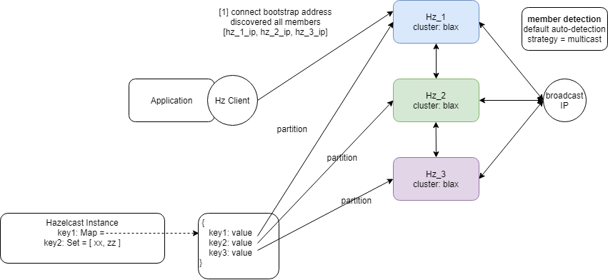
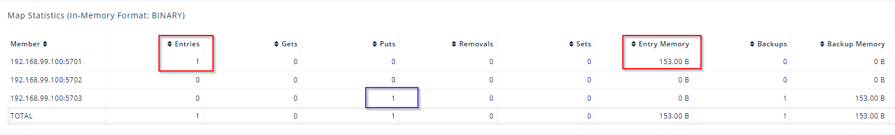

## Clustered Storage Playground
To understand the connectivity behaviour from different distributed/clustered storage

### Hazelcast
- In this setup, we bring up hazelcast cluster (blax) using hazelcast docker and connect as Hz client from the application side 
- default auto-detection to multicast `<auto-detection enabled="true"/>`
- Using a record type of Map, observed that hazelcast deals with each of the map entry individually, each entry will be assigned to a partition (instance) for read/write 

- Result can be observed from the management ui where an entry is written to 1st instance and be backup in the 3rd instance
- Further tested with a large payload and found out from wiremock that most of the traffic is forward to the partitioned instance

#### References
- [Hz Docker](https://github.com/hazelcast/hazelcast-docker)
- [Hz Discovery](https://hazelcast.com/blog/hazelcast-discovery-auto-detection/)