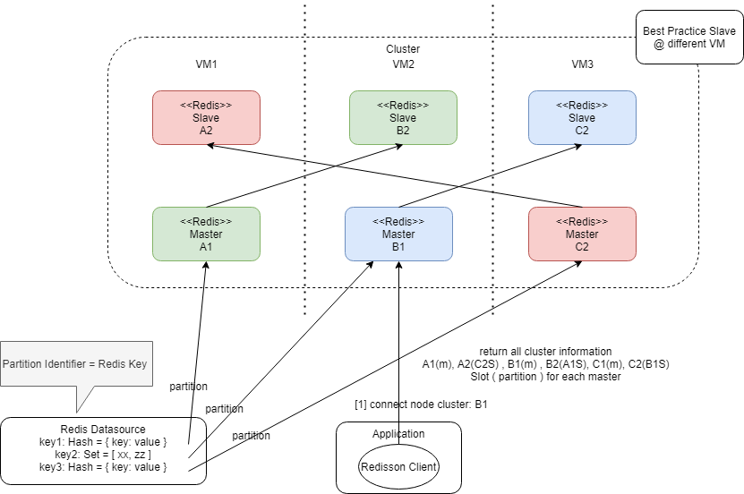

## Distributed DataStore Playground
To understand the connectivity behaviour from different distributed data storage

### Hazelcast
- In this setup, we bring up hazelcast cluster (blax) using hazelcast docker and connect as Hz client from the application side 
- default auto-detection to multicast `<auto-detection enabled="true"/>`
- Using a record type of Map, observed that hazelcast deals with each of the map entry individually, each entry will be assigned to a partition (instance) for read/write 

- Result can be observed from the management ui where an entry is written to 1st instance and be backup in the 3rd instance
- Further tested with a large payload and found out from wiremock that most of the traffic is forward to the partitioned instance

#### References
- [Hz Docker](https://github.com/hazelcast/hazelcast-docker)
- [Hz Discovery](https://hazelcast.com/blog/hazelcast-discovery-auto-detection/)

### Redis
- Redis in cluster mode is relatively inefficient as a single redis node can be either in master or slave mode
  - master (write) and slave (read) design similar like RDBMS replication design
- This playground makes use of redis image provisioned by `bitnami` as the naked redis image is not cloud friendly
- Even with `bitnami` there's limitation on the deployment setup as well. E.g.
    - redis cluster can't operate on hostname level ( must be IP based )
    - Only allow a single network. Failed to set up different urls for public and private (cluster internal) usage.
        - experimented with `cluster-announce-ip` and `cluster-announce-port`, din work and switched to `network_mode: "host"`

- Partition key (slot) is calculation [here](https://github.com/redisson/redisson/blob/master/redisson/src/main/java/org/redisson/cluster/ClusterConnectionManager.java#L726) , where key = map key
- Redis commander (web console) is accessible at `${dockerHost}:8081`

#### References
- [How Redis partitioning works](https://redis.io/topics/partitioning)
- [bitnami redis repository](https://github.com/bitnami/bitnami-docker-redis-cluster)